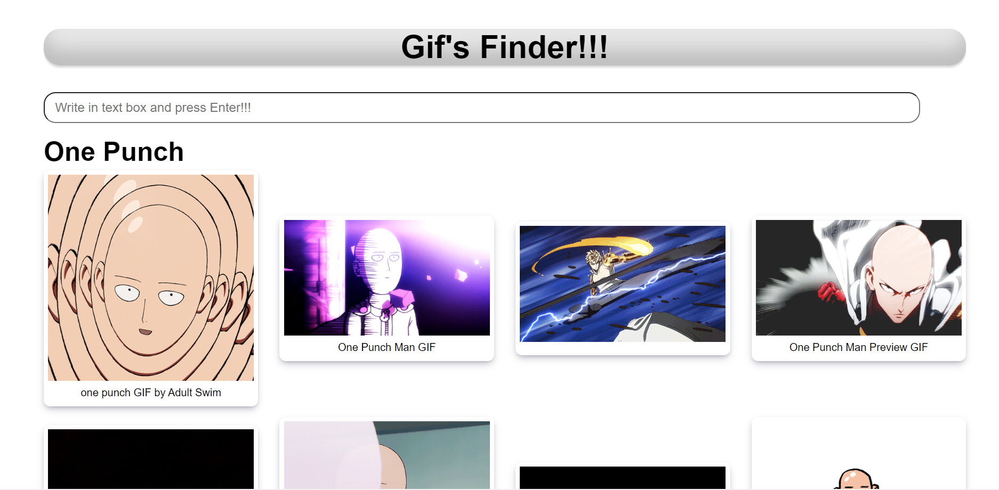

# Gif APP

Este es mi repositorio del proyecto "GifExpertApp" del curso recientemente actualizado "https://www.udemy.com/course/react-cero-experto/" de Fernando Herrera que estoy cursando actualmente en el cual estoy dando los primeros pasos en React, consolidando mi practica de Javascript, y realizando testing con Jest y ReactTestingLibrary. 
